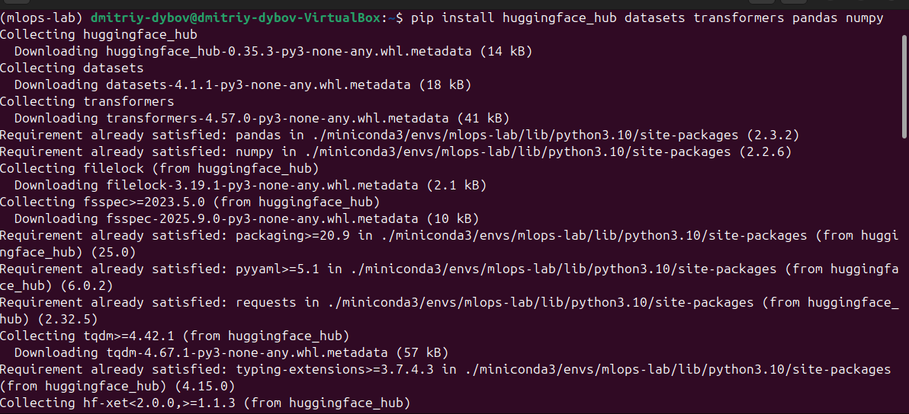
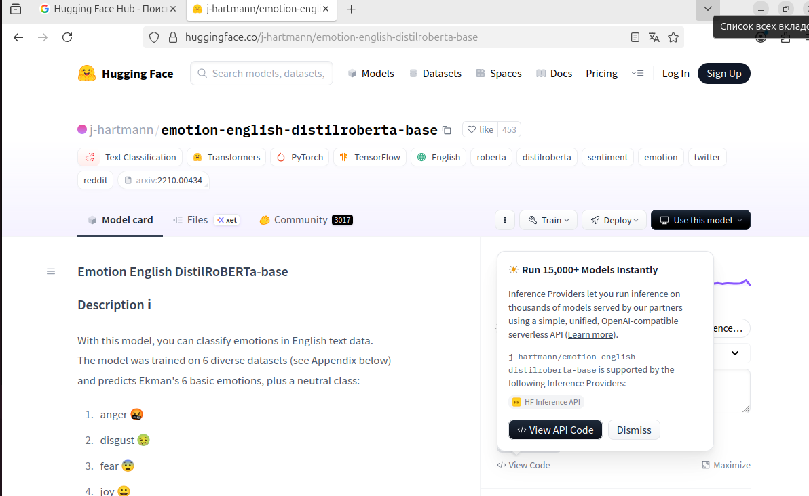
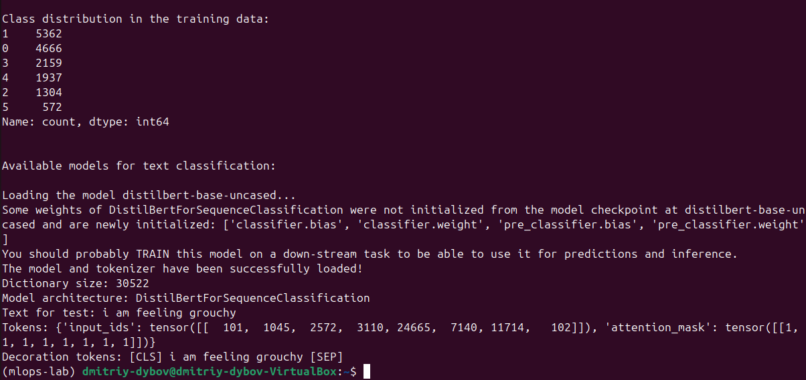
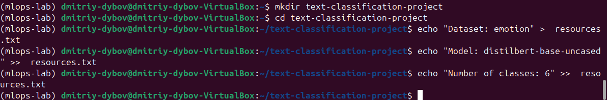

# МИНИCTEPCTBO НАУКИ И ВЫСШЕГО ОБРАЗОВАНИЯ РОССИЙСКОЙ ФЕДЕРАЦИИ
## Федеральное государственное автономное образовательное учреждение высшего образования «Северо-Кавказский федеральный университет» Институт перспективной инженерии

### Отчет по лабораторной работе 2
### Знакомство с платформой Hugging Face Hub, тонкая настройка модели для текстовой классификации, интеграция MLflow для трекинга экспериментов
Дата: 2025-11-17 \
Семестр: [2 курс 1 полугодие - 3 семестр] \
Группа: ПИН-м-о-24-1 \
Дисциплина: Технологии программирования \
Студент: Дыбов Д.В.
#### Цель работы
Освоение базовых принципов работы с Hugging Face Hub; практическая тонкая настройка предобученных моделей для текстовой классификации; интеграция MLflow для трекинга экспериментов, логирования гиперпараметров/метрик/артефактов и моделей.
#### Теоретическая часть
Краткие изученные концепции:
- Hugging Face Hub: репозитории моделей, токенизаторы, датасеты.
- Trainer API: TrainingArguments, evaluation_strategy (evaluation_during_training при необходимости), compute_metrics.
- MLflow: настройка tracking_uri, mlflow.start_run, mlflow.log_param, mlflow.log_metric, mlflow.log_artifact / mlflow.log_artifacts, mlflow.log_model.
- Подготовка данных: train/validation split, токенизация, формат datasets.Dataset.
#### Практическая часть
##### Выполненные задачи
- [x] Установить пакеты: huggingface_hub, datasets, transformers, pandas, numpy.
- [x] Найти подходящую модель на Hugging Face Hub и изучить карточку модели.
- [x] Создать скрипт hf_hub_exploration.py — скачать модель/датасет и проверить содержимое.
- [x] Подготовить проект и файл resources.txt с информацией о выбранных ресурсах.
- [x] Создать fine_tuning.py (использован параметр evaluation_during_training при необходимости).
- [x] Запустить MLflow Tracking Server и интегрировать обучение через mlflow_integration.py.
- [x] Провести гиперпараметрическое исследование с hyperparameter_tuning.py.
- [x] Проанализировать результаты в analyze_results.py.
##### Ключевые фрагменты кода
- Скрипт hf_hub_exploration.py:
```python
# Пример интеграции тренировки с MLflow (схематично)
from transformers import Trainer, TrainingArguments, AutoModelForSequenceClassification, AutoTokenizer
import mlflow

mlflow.set_tracking_uri("http://localhost:5000")
mlflow.set_experiment("Emotion-Classification-FineTuning")

tokenizer = AutoTokenizer.from_pretrained("bert-base-uncased")
model = AutoModelForSequenceClassification.from_pretrained("bert-base-uncased", num_labels=6)

training_args = TrainingArguments(
    output_dir="./outputs",
    evaluation_strategy="epoch",
    per_device_train_batch_size=16,
    per_device_eval_batch_size=32,
    num_train_epochs=3,
    logging_steps=50,
    save_steps=500,
)

with mlflow.start_run():
    mlflow.log_param("model_name", "bert-base-uncased")
    mlflow.log_param("epochs", training_args.num_train_epochs)
    trainer = Trainer(model=model, args=training_args, train_dataset=train_dataset, eval_dataset=eval_dataset, compute_metrics=compute_metrics)
    trainer.train()
    metrics = trainer.evaluate()
    mlflow.log_metrics(metrics)
    trainer.save_model("saved_model")
    mlflow.log_artifacts("saved_model")
```
##### Результаты выполнения
1. Установлены пакеты huggingface_hub, datasets, transformers, pandas, numpy. \ 
 \
Рисунок 1 – Установка пакетов \

2. На Hugging Face Hub найден подходящий репозиторий модели и изучена модельная карточка. \ 

Рисунок 2 – Найденная модель на Hugging Face Hub \

3. Создан hf_hub_exploration.py, выполнено скачивание модели/датасета и проверка содержимого. \ 

Рисунок 3 – Выполнение hf_hub_exploration.py \

4. Создана папка проекта и resources.txt с записями выбранных ресурсов. \ 

Рисунок 4 – Создание проекта и resources.txt \

5. Создан fine_tuning.py; в коде использован параметр evaluation_during_training при необходимости; запущен тренинг. \ 

Рисунок 5 – Содержимое fine_tuning.py \

6. Запущен MLflow Tracking Server; произведена интеграция через mlflow_integration.py. \ 

Рисунок 6 – MLflow Tracking Server \

7. В MLflow появился эксперимент Emotion-Classification-FineTuning с зафиксированными параметрами и метриками. \ 

Рисунок 7 – Эксперимент в MLflow \

8. Проведён гиперпараметрический перебор (hyperparameter_tuning.py); запуски отображены в MLflow. \ 

Рисунок 8 – Запуски hyperparameter_tuning.py \

9. Выполнен анализ результатов (analyze_results.py); получены таблицы и визуализации по метрикам. \ 

Рисунок 9 – Анализ экспериментов \

##### Тестирование
[x] Модульные тесты — не применялись.
[x] Интеграционные тесты — проверены интеграции: HF Hub <-> Trainer <-> MLflow.
[x] Производительность — учебная выборка; масштабирование требует отдельной настройки.
##### Выводы
- Освоены основные механизмы работы с Hugging Face Hub: поиск, загрузка моделей и датасетов.
- Реализована тонкая настройка предобученной модели для текстовой классификации с использованием Transformers; устранены несовместимости параметров обучения.
- Интеграция с MLflow выполнена: гиперпараметры, метрики и артефакты логируются и доступны для анализа; выполнено сравнение запусков и HPO-исследование.
##### Приложения
- Скрипты: hf_hub_exploration.py, fine_tuning.py, mlflow_integration.py, hyperparameter_tuning.py, analyze_results.py.
- resources.txt с перечислением моделей/датасетов.
- Скриншоты результатов в папке report/
