# МИНИCTEPCTBO НАУКИ И ВЫСШЕГО ОБРАЗОВАНИЯ РОССИЙСКОЙ ФЕДЕРАЦИИ
## Федеральное государственное автономное образовательное учреждение высшего образования «Северо-Кавказский федеральный университет» Институт перспективной инженерии

### Отчет по лабораторной работе 2
### Знакомство с платформой Hugging Face Hub, тонкая настройка модели для текстовой классификации, интеграция MLflow для трекинга экспериментов
Дата: 2025-11-17 \
Семестр: [2 курс 1 полугодие - 3 семестр] \
Группа: ПИН-м-о-24-1 \
Дисциплина: Технологии программирования \
Студент: Дыбов Д.В.
#### Цель работы
Освоение базовых принципов работы с Hugging Face Hub; практическая тонкая настройка предобученных моделей для текстовой классификации; интеграция MLflow для трекинга экспериментов, логирования гиперпараметров/метрик/артефактов и моделей.
#### Теоретическая часть
Краткие изученные концепции:
- Hugging Face Hub: репозитории моделей, токенизаторы, датасеты.
- Trainer API: TrainingArguments, evaluation_strategy (evaluation_during_training при необходимости), compute_metrics.
- MLflow: настройка tracking_uri, mlflow.start_run, mlflow.log_param, mlflow.log_metric, mlflow.log_artifact / mlflow.log_artifacts, mlflow.log_model.
- Подготовка данных: train/validation split, токенизация, формат datasets.Dataset.
#### Практическая часть
##### Выполненные задачи
- [x] Установить пакеты: huggingface_hub, datasets, transformers, pandas, numpy.
- [x] Найти подходящую модель на Hugging Face Hub и изучить карточку модели.
- [x] Создать скрипт hf_hub_exploration.py - скачать модель/датасет и проверить содержимое.
- [x] Подготовить проект и файл resources.txt с информацией о выбранных ресурсах.
- [x] Создать fine_tuning.py (использован параметр evaluation_during_training при необходимости).
- [x] Запустить MLflow Tracking Server и интегрировать обучение через mlflow_integration.py.
- [x] Провести гиперпараметрическое исследование с hyperparameter_tuning.py.
- [x] Проанализировать результаты в analyze_results.py.
##### Ключевые фрагменты кода
- Скрипт hf_hub_exploration.py:
```python
from datasets import load_dataset
from huggingface_hub import list_models, list_datasets
import pandas as pd

print("Available datasets for text classification:")
datasets = list_datasets(filter="task_categories:text-classification")
for dataset in datasets:
	print(f"- {dataset.id}")

print("\nUloading dataset emotion...")
dataset = load_dataset("emotion")

print(f"\nDataset structure: {dataset}")
print(f"\nExamples from train split:")
train_df = pd.DataFrame(dataset['train'][:5])
print(train_df)

print("\nClass distribution in the training data:")
label_counts = pd.Series(dataset['train']['label']).value_counts()
print(label_counts)

print("\n\nAvailable models for text classification:")
models = list_models(
	filter="task:text-classification",
	sort="downloads",
	direction=-1,
	limit=5
)

for model in models:
	print(f"\nModel: {model.id}")
	print(f"\nDownloads: {model.downloads}")
	print(f"\nTags: {model.tags}")
	if model.pipeline_tag:
		print(f"Task type: {model.pipeline_tag}")

from transformers import AutoTokenizer, AutoModelForSequenceClassification

model_name = "distilbert-base-uncased"
print(f"\nLoading the model {model_name}...")

tokenizer = AutoTokenizer.from_pretrained(model_name)
model = AutoModelForSequenceClassification.from_pretrained(
	model_name,
	num_labels=6 #Num of classes in dataset
)

print("The model and tokenizer have been successfully loaded!")
print(f"Dictionary size: {tokenizer.vocab_size}")
print(f"Model architecture: {model.__class__.__name__}")

test_text = "i am feeling grouchy"
print(f"Text for test: {test_text}")

tokens = tokenizer(test_text, return_tensors="pt")
print(f"Tokens: {tokens}")
print(f"Decoration tokens: {tokenizer.decode(tokens['input_ids'][0])}")
```
- Скрипт hf_hub_exploration.py:
```python

```
##### Результаты выполнения
1. Установлены пакеты huggingface_hub, datasets, transformers, pandas, numpy. \
 \
Рисунок 1 – Установка пакетов 
2. На Hugging Face Hub найден подходящий репозиторий модели и изучена модельная карточка. \
 \
Рисунок 2 – Найденная модель на Hugging Face Hub 
3. Создан hf_hub_exploration.py, выполнено скачивание модели. \
 \
Рисунок 3 – Выполнение hf_hub_exploration.py 
4. Создана папка проекта и resources.txt с записями выбранных ресурсов. \
 \
Рисунок 4 – Создание проекта и resources.txt \
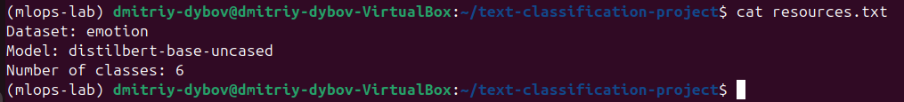 \
Рисунок 5 – Проверка содержимого resources.txt 
5. Создан fine_tuning.py, в коде использован параметр eval_training вместо evaluation_training, запущен тренинг. \
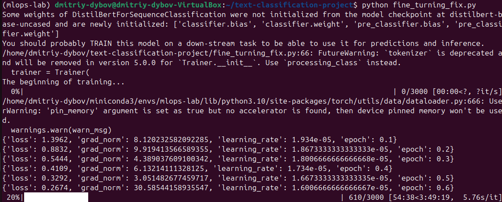 \
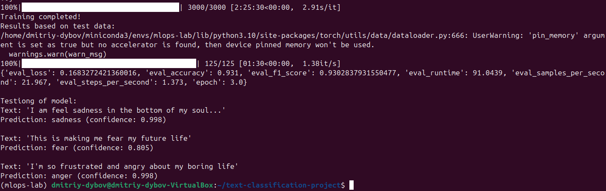 \
Рисунок 6 – Запуск fine_tuning.py 
7. Запущен MLflow Tracking Server, произведена интеграция через mlflow_integration.py. \
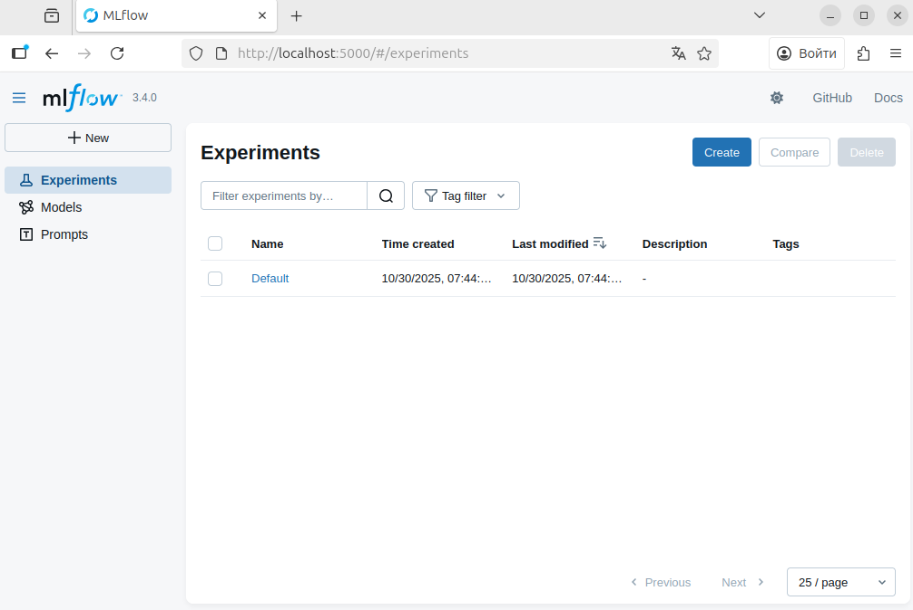 \
Рисунок 7 – MLflow Tracking Server 
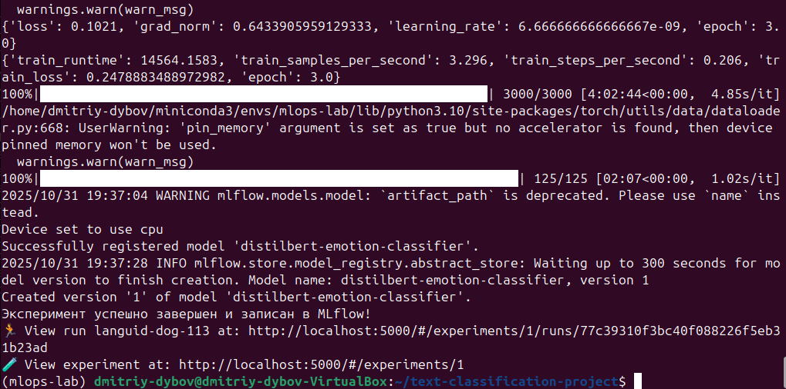 \
Рисунок 8 – Выполнение mlflow_integration.py \
7. В MLflow появился эксперимент Emotion-Classification-FineTuning с зафиксированными параметрами и метриками. \
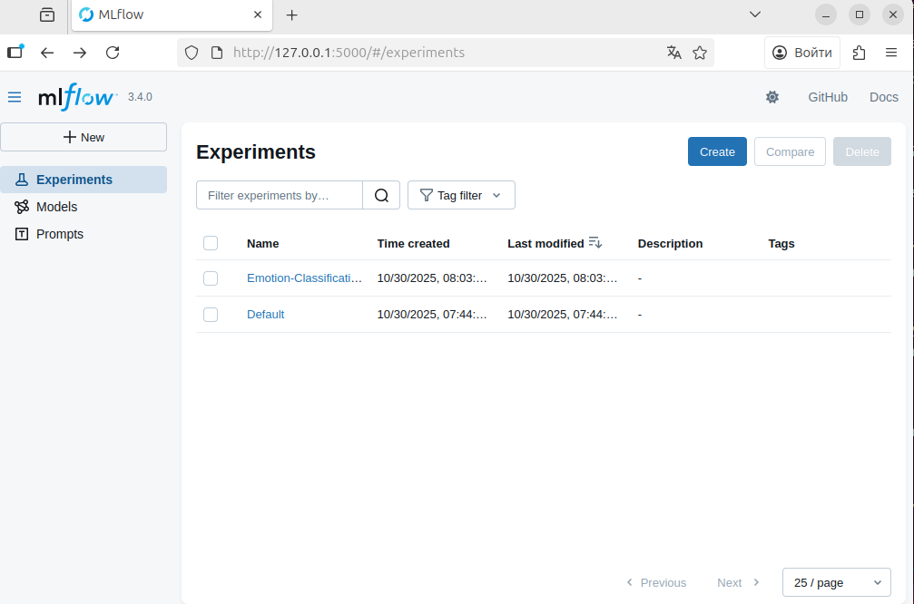 \
Рисунок 9 – Эксперимент в MLflow \
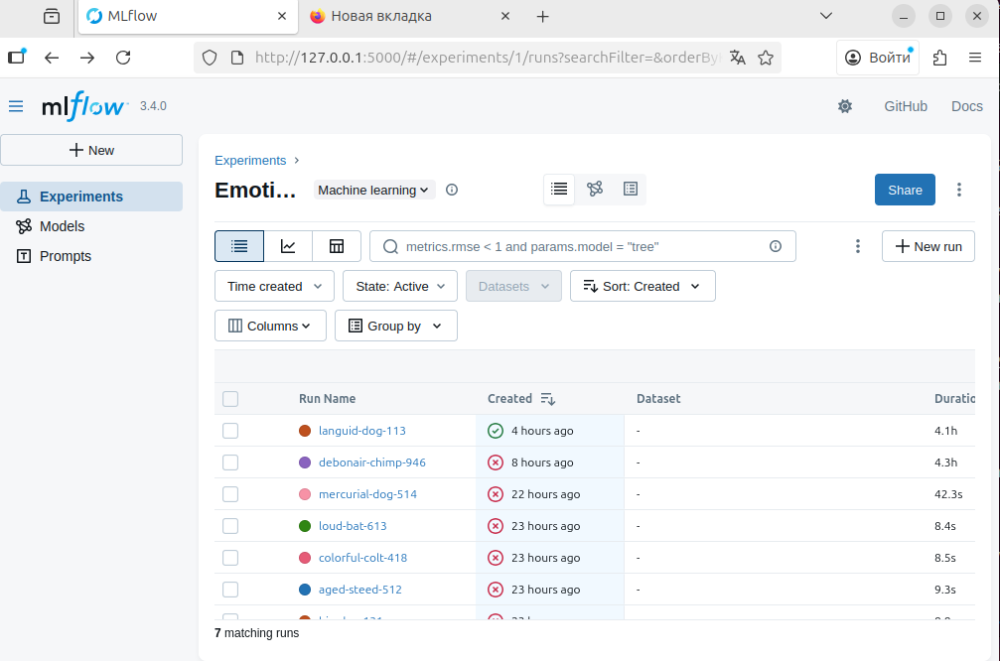 \
Рисунок 10 – Все запуски скрипта \
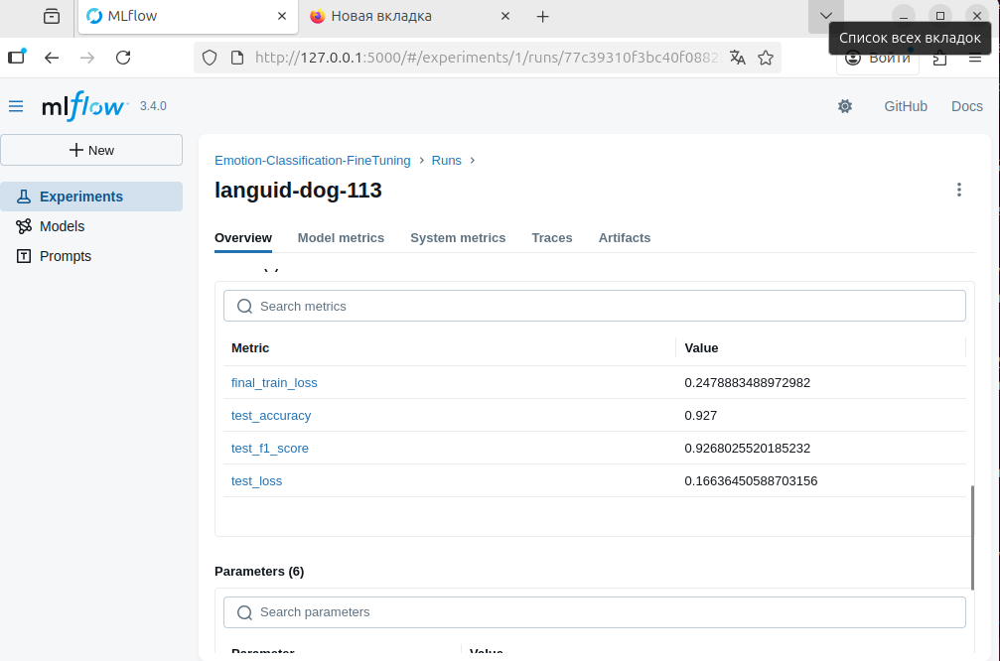 \
Рисунок 11 – Полученные метрики \
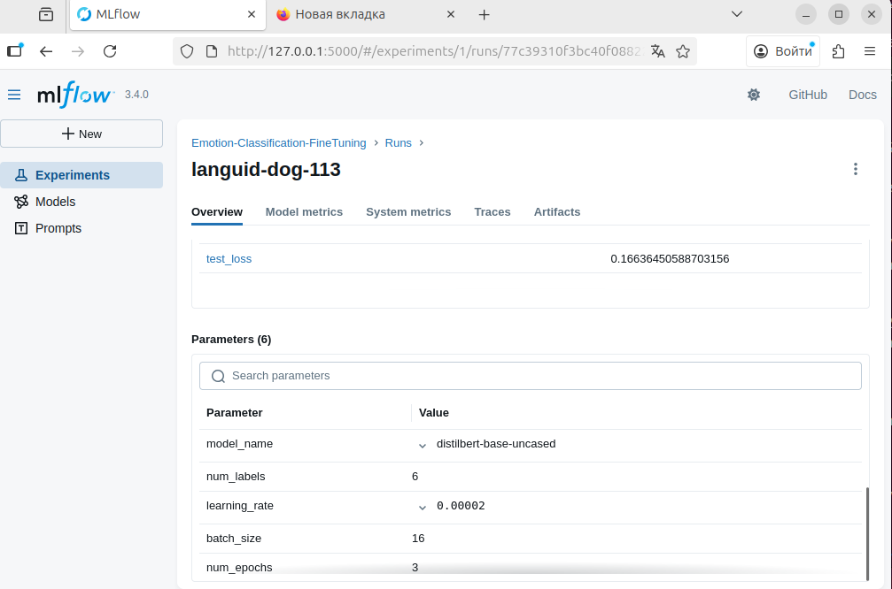 \
Рисунок 12 – Параметры скрипта \
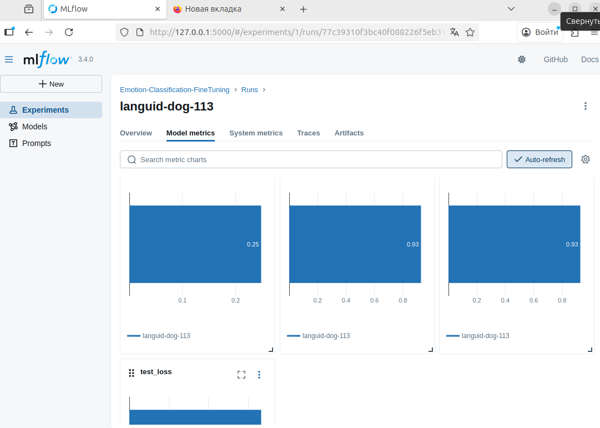 \
Рисунок 13 – Модели метрик \
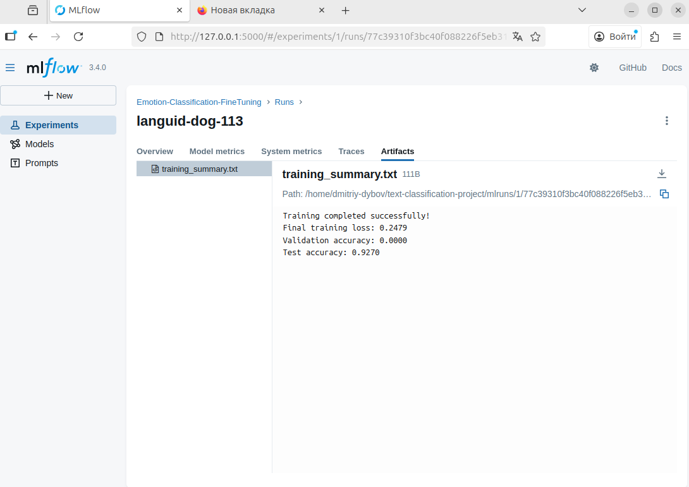 \
Рисунок 14 –Содержимое вкладки Artifacts
8. Проведён гиперпараметрический перебор (hyperparameter_tuning.py); запуски отображены в MLflow. \
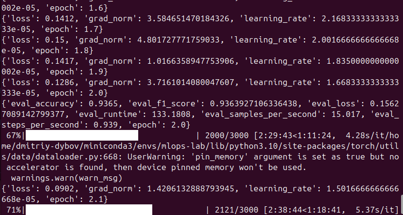 \
Рисунок 15 – Запуск hyperparameter_tuning.py \
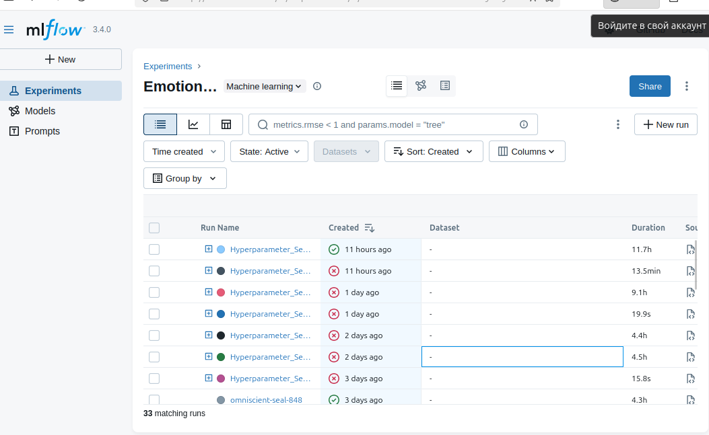 \
Рисунок 16 – Все запуски скрипта
9. Выполнен анализ результатов (analyze_results.py), получены таблицы и визуализации по метрикам. \
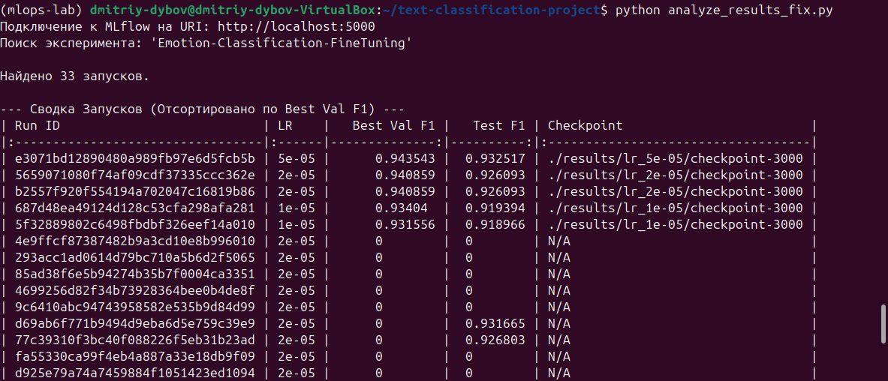 \
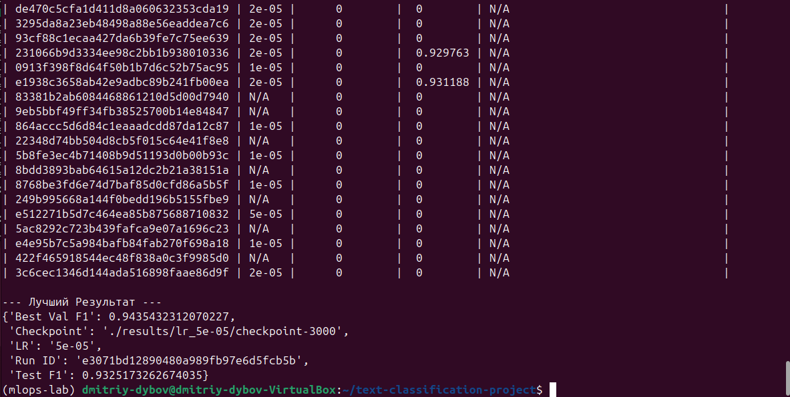 \
Рисунок 17 – Анализ экспериментов

##### Тестирование
- [x] Модульные тесты - не применялись.
- [x] Интеграционные тесты - проверены интеграции: HF Hub <-> Trainer <-> MLflow.
- [x] Производительность - учебная выборка; масштабирование требует отдельной настройки.
##### Выводы
Освоены основные механизмы работы с Hugging Face Hub: поиск, загрузка моделей и датасетов. Реализована тонкая настройка предобученной модели для текстовой классификации с использованием Transformers; устранены несовместимости параметров обучения. Интеграция с MLflow выполнена: гиперпараметры, метрики и артефакты логируются и доступны для анализа; выполнено сравнение запусков.
##### Приложения
- Скрипты: hf_hub_exploration.py, fine_tuning.py, mlflow_integration.py, hyperparameter_tuning.py, analyze_results.py.
- resources.txt с перечислением моделей/датасетов.
- Скриншоты результатов в папке report/
